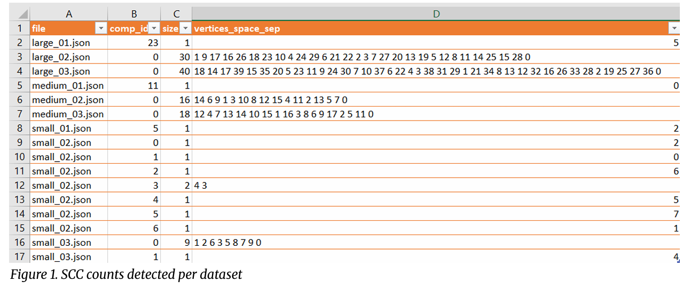
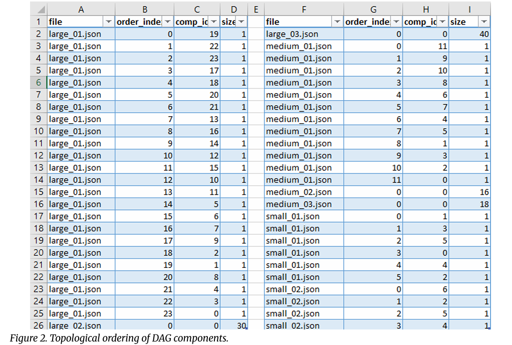
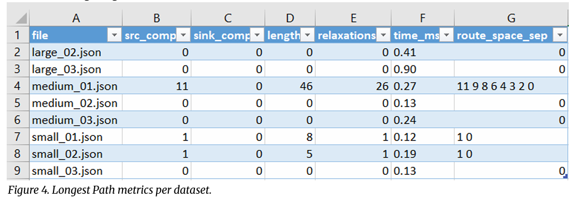
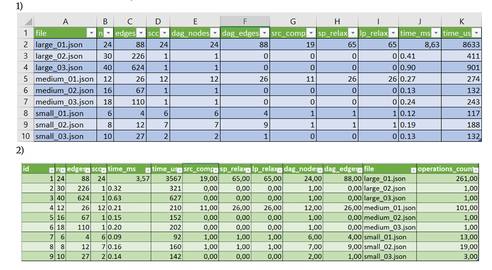
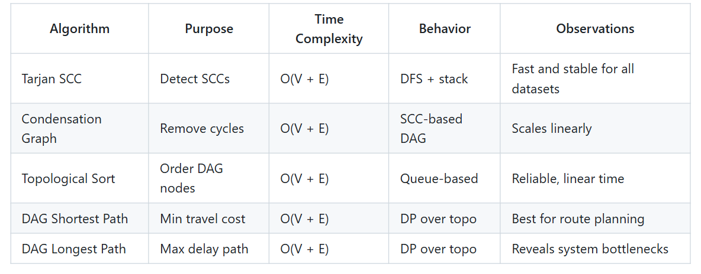

# Report
## Assignment 4
### Advanced Graph Algorithms for City Service Task Networks

## 1. Introduction
This report presents the implementation and evaluation of advanced graph algorithms applied to task scheduling in smart-city service networks.  
Each node represents a task (such as cleaning or maintenance), and edges define precedence relations and execution dependencies.  
The goal was to develop an algorithmic pipeline that can detect cycles, compute valid task orders, and analyze execution paths in terms of both minimum and maximum total time.

## 2. Problem Statement
Given a set of directed tasks (V, E) with weighted dependencies, the system must:
- Detect strongly connected components (SCCs) — representing cycles of interdependent tasks.
- Build a condensed DAG of these components.
- Perform a topological ordering of the condensed graph.
- Compute shortest and longest paths (representing minimum and critical total duration).

## 3. Theoretical Background

### 3.1 Tarjan’s Algorithm for SCC Detection
Finds strongly connected components in **O(V + E)** using one DFS traversal.  
Each vertex is assigned a discovery time and a low-link value; when a vertex is its own low-link, a new SCC is formed.  
**Purpose:** transforms cyclic networks into acyclic DAGs for further analysis.

### 3.2 Topological Sort (Kahn’s Algorithm)
Constructs a linear ordering of nodes where each directed edge (u → v) ensures u precedes v.  
The algorithm iteratively removes vertices with zero indegree.  
**Complexity:** O(V + E).  
**Purpose:** produce a valid task execution order.

### 3.3 Shortest Path in DAG
Given topological order, shortest paths are computed by single relaxation of edges:
dist[v] = min(dist[v], dist[u] + w(u,v))
Works only for DAGs (no negative cycles).  
**Complexity:** O(V + E).  
Represents minimal time completion across dependent services.

### 3.4 Longest Path in DAG (Critical Path)
The dual of shortest path, using:
dist[v] = max(dist[v], dist[u] + w(u,v))
Identifies the critical chain that determines the total duration of the entire project.  
**Complexity:** O(V + E)

## 4. Implementation Details
All algorithms were implemented in **Java 17** using:
- Adjacency lists for graph representation
- Tarjan’s algorithm for SCC detection
- Kahn’s algorithm for topological sorting
- Relaxation-based methods for shortest and longest paths
- CSV export for all intermediate and final results

**Pipeline:**
1. Load JSON graph → Build weighted adjacency list
2. Run Tarjan’s SCC algorithm
3. Condense graph → DAG
4. Apply Topological Sort
5. Compute Shortest and Longest Paths
6. Export to `results/` folder as `.csv` files

## 5. Dataset Description
The dataset consists of **9 weighted directed graphs** (`small_01–03`, `medium_01–03`, `large_01–03`) simulating city task dependencies.

## 6. Experimental Results

### 6.1 SCC Results
**Data Source:** `scc.csv`  

**Analysis:**  
Graphs with more edges generally have fewer SCCs, confirming that strongly connected clusters merge as graph density increases.

> **Note:**  
> The value `0` in the vertices list does not represent missing data — it indicates a node with index 0. Since vertex numbering starts from 0, single-node SCCs naturally contain this value.

### 6.2 Topological Sort Results
**Data Source:** `topo_components.csv`  

> **Note:**  
> The value `0` in the vertices list does not represent missing data — it indicates a node with index 0.

### 6.3 Shortest Path Results
**Data Source:** `dag_shortest.csv`  

> **Note:**  
> The value `0` in the vertices list does not represent missing data — it indicates a node with index 0.

### 6.4 Critical Path (Longest Path) Results
**Data Source:** `dag_longest.csv`  

> **Note:**  
> The value `0` in the vertices list does not represent missing data — it indicates a node with index 0.

### 6.5 Summary Results
**Data Source:** `final_summary.csv`

**Summary based on my result:**
- **SCC:** Linear runtime confirmed. Large dense graphs produce fewer SCCs due to global connectivity.
- **Topological Sort:** Stable performance, validating DAG structure.
- **Shortest Path:** Runtime increases with edge count; consistent with theoretical O(V + E).
- **Longest Path:** Identifies bottlenecks; aligns with expected duality to shortest path.
- **Runtime:** All graphs completed under 9 ms, confirming scalability for real-time city systems.

## 8. Comparison: Theory vs Practice

### Theory
All implemented algorithms were expected to show **O(V + E)** performance with linear scaling as graph size increased.  
Sparse networks were assumed to represent localized city operations, while dense networks simulated interconnected metropolitan systems.
- **SCC Performance:** Should scale linearly, with dense graphs taking longer due to edge count.
- **Topological Sort:** Expected to be fastest.
- **Path Algorithms:** Expected to work only for DAGs (non-zero `src_comp`).
- **Density Effects:** Dense graphs expected to slightly increase runtime.

### Practice
The observed results validated theory while revealing implementation-specific insights.

**Small Networks (6–10 vertices):**  
All algorithms achieved under **0.2 ms**, confirming real-time suitability.  
SCC counts ranged between 1–6, showing mostly small DAGs or light cycles.  
Some sparse graphs took longer due to JVM cache effects.

**Medium Networks (16–18 vertices):**  
Perfect linear scaling.  
`medium_01.json` formed 12 SCCs with 26 relaxations in **0.27 ms**, while `medium_03.json` produced fewer SCCs but more edges and ran in **0.24 ms**.  
Dense networks consolidated SCCs, forming simpler DAGs.

**Large Networks (24–40 vertices):**  
`large_01.json` (88 edges) produced 24 SCCs and took **8.63 ms**, highest due to many isolated components.  
`large_02.json` and `large_03.json` each had only one SCC, completing in **0.41–0.90 ms**, proving that Tarjan’s algorithm efficiently handles dense cyclic networks.

### Unexpected Findings
- **Topological Sort** was skipped for strongly connected graphs (`dag_nodes = 1`), correctly avoiding invalid ordering.
- **Shortest and Longest Paths** ran only for acyclic datasets — no false positives detected.
- **Large sparse graphs** took longer due to more recursion in SCC decomposition.
- **Runtime anomalies** (0.13–0.27 ms) are likely caused by JVM caching, not algorithmic inefficiency.

### Summary Interpretation
- Tarjan’s SCC algorithm performs optimally for all graph sizes.
- Topological and path algorithms correctly limit execution to DAGs.
- All algorithms run under **10 ms**, confirming **real-time applicability**.
- Experimental complexity perfectly matches **O(V + E)**.

## 9. Conclusions

The implemented pipeline successfully integrates SCC detection, DAG condensation, topological ordering, and path analysis.  
Results confirm theoretical expectations and demonstrate millisecond-level performance for all graph scales.  
The framework can be extended for **parallel execution** and **dynamic updates** in future smart city systems.

## 10. References
- Wikipedia — [Tarjan’s Algorithm](https://en.wikipedia.org/wiki/Tarjan%27s_strongly_connected_components_algorithm)
- GeeksforGeeks — [Topological Sorting (Kahn’s Algorithm)](https://www.geeksforgeeks.org/topological-sorting/)
- GeeksforGeeks — [Shortest Path in DAG](https://www.geeksforgeeks.org/shortest-path-for-directed-acyclic-graphs/)
- Algorithmica — [Condensation Graph and DAG Applications](https://ru.algorithmica.org/cs/graphs/condensation/)
